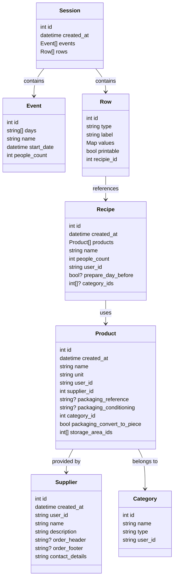

# Matta-Nuu

https://matta-nuu.netlify.app/#/

### Stack

- VueJs 3 + Vue CLI
- Database with [Supabase](https://supabase.com/). [Voir la doc](https://supabase.com/docs/reference/javascript/select)
- Component Library : [Primevue](https://primevue.org/)

### Project setup

- Install [NVM](https://github.com/nvm-sh/nvm)
- `git clone https://github.com/dhammaorg/matta-nuu.git`
- `cd matta-nuu`
- `nvm use`
- `npm install -g yarn`
- `yarn install`

### Compiles and hot-reloads for development

```
yarn serve
```

### Production database is used for dev

Be careful, the same database (provided by supabase) is used for production and dev.
So for dev purpose beter create a new user so you'll be sure to not break anything

### Compiles and minifies for production

```
yarn build
```

### Linters

If you are using VSCode, please use the existing configuration
`cp .vscode/settings-example.json .vscode/settings.json` and install the recommended extensions

Otherwise, before pushing you run linters with

```
yarn lint
```

### Customize configuration

See [Configuration Reference](https://cli.vuejs.org/config/).

### Database scheme


